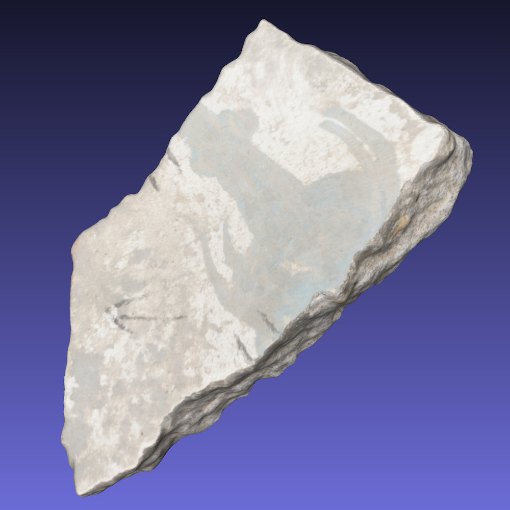
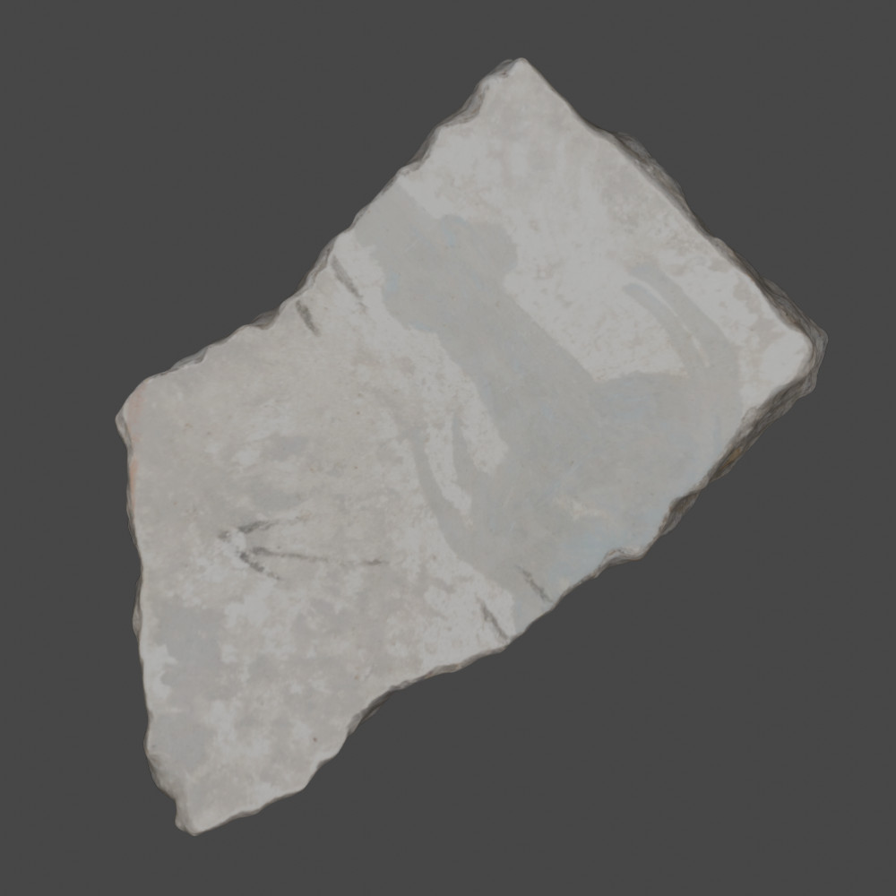

# pcd2images

Code to render image of the top flat *textured* surface of a fresco fragment from its 3D mesh (`.obj`). 

| Mesh | Image |
|:----:|:-----:|
|||
| the 3d mesh (meshlab) | the rendered 2d image |

## WARNING: 
work in progress, it may not always work as intended. At the moment is relying on having a large top flat surface, otherwise it will fails. 
Dependencies should be easy (`open3d`, `numpy`, `blender`), but I do not have documentation on the installation for now.
And also remember to change the paths, they are hard-coded.

# Usage 
The fastest way is to use the `render_group.sh` bash script.
Just set the variables in the first lines and run it with 
```
sh render_group.sh
```
And should do both steps one after the other.

## Workflow
For debugging or to understand how it works, the workflow is divided into two steps:

### 1. Aligning the meshes using the normal of the top surface plane
To do this, you can run 
```python
python3 align_face_up.py --group $group
```
where `$group` is the number of the group you want to render. It assumes you have the folder structured as described in the data management plan, otherwise quickly edit the code.

It reads the meshes (`.obj` files) and tries to align them on the z-axis (if you open them on meshlab, they should be perpendicular, so you see the top surface). 
It Does not segment anything, only aligns. It is not perfect and works only for flat pieces (even if they are too small sometimes it fails).
We know this, but at the moment we do not have anything better. With a proper segmentation and face detection, this step should be replaced.
It may be helpful to actually visualize the meshes afterwards to check if it worked.

It relies on `open3d` and `numpy`.

### 2. Rendering in the background using a blender scene to get a 2D image
To do this, you can run 
```python 
blender -b $blend_scene -P blender_render.py -o $output_root_folder -- group $group
```
where `$blend_scene` is the blender file with the scene (it contains a camera and a light/sun), `$output_root_folder` is the output folder (where you want to save the rendered images) and `$group` is the group you want to render (it will create a sub-folder within `output_root_folder` with the group number).

It relies on `blender` and `bpy`.

